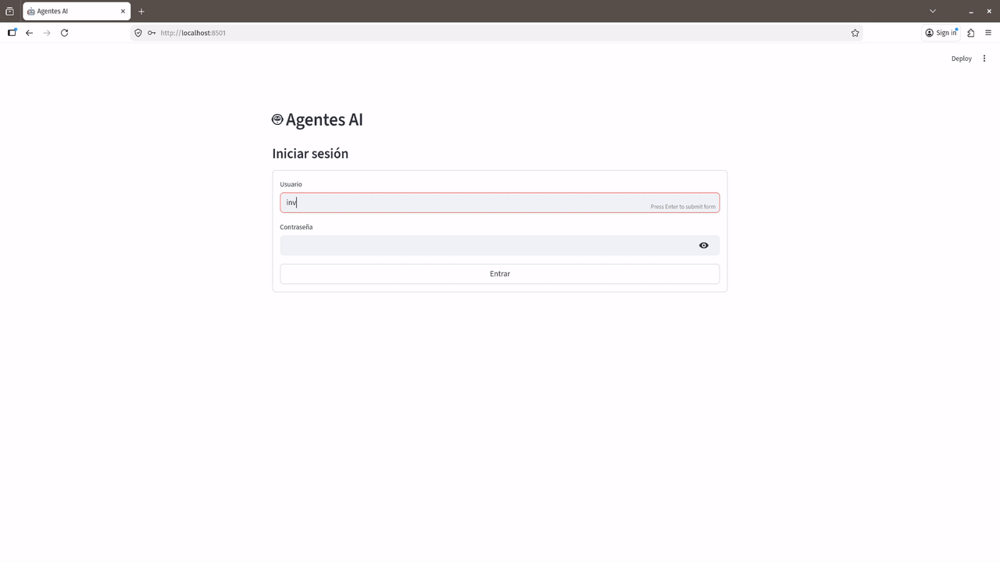
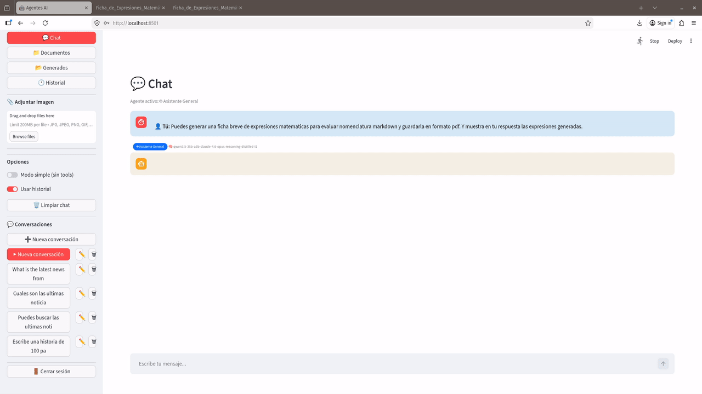
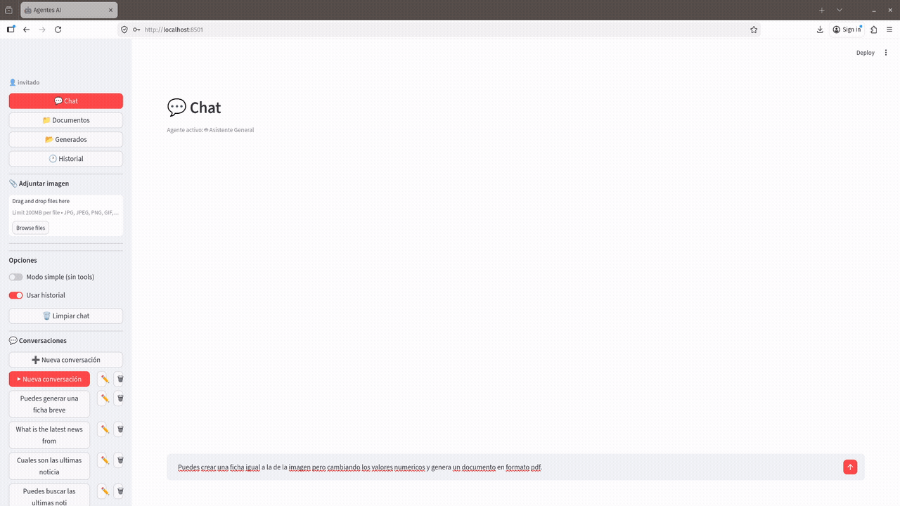
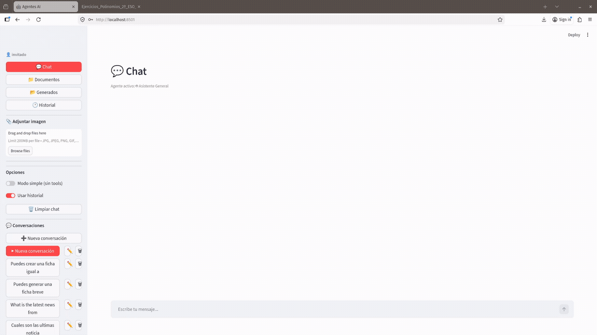

# 🤖 Agentes AI — Multi-Agent System with Local LLMs

A production-grade multi-agent AI system designed for private, local deployment. Built on **LangGraph**, **FastAPI** and **Streamlit**, it runs entirely on your own hardware using **LM Studio** as the LLM backend — no cloud dependencies, no data leaving your network.



---

## Table of Contents

- [Overview](#overview)
- [Architecture](#architecture)
- [Key Design Decisions](#key-design-decisions)
- [Agent System](#agent-system)
- [Multimodal Vision](#multimodal-vision)
- [RAG Pipeline](#rag-pipeline)
- [Tools & Code Interpreter](#tools--code-interpreter)
- [Document Generation](#document-generation)
- [Semantic Memory](#semantic-memory)
- [Agenda & Task Management](#agenda--task-management)
- [Hardware Requirements](#hardware-requirements)
- [Installation](#installation)
- [Configuration](#configuration)
- [Usage](#usage)
- [Project Structure](#project-structure)
- [Testing](#testing) 
- [Known Limitations](#known-limitations)
- [Roadmap](#roadmap)

---

## Overview

This project started as a personal assistant system and evolved into a multi-user, multi-agent platform. The core idea: leverage local open-source LLMs (Qwen, Mistral, LLaMA variants) through LM Studio's OpenAI-compatible API, combined with a robust toolset and memory system, to create agents that genuinely remember context across sessions and assist with complex real-world tasks.

**What makes this system different from typical RAG chatbots:**

- **Persistent semantic memory** — agents remember past conversations using vector embeddings, not just recent chat history
- **Adaptive RAG** — chunking strategy adapts to document type (transcripts vs structured documents)
- **Multimodal vision** — agents can receive and analyze images alongside text, using models that support vision (Qwen3.5, gema-4, etc.). Images are embedded inline in the conversation UI, enabling real-world use cases like analyzing worksheet photos, charts, tables or handwritten notes
- **Real document generation** — produces properly formatted PDF and DOCX files with native math equations via pandoc+tectonic/mathml
- **Per-user configuration** — each user can have different agents, modes and history settings without code changes
- **Production streaming** — full streaming with tool call visibility (`🔍 Buscando en la web...`) via Server-Sent Events

---

## Architecture

```
┌─────────────────────────────────────────────────────────┐
│                    Frontend (Streamlit)                 │
│  Multi-conversation panel · Agent badges · File upload  │
│  Inline plots · Table rendering · Document download     │
└───────────────────────┬─────────────────────────────────┘
                        │ HTTP / SSE streaming
┌───────────────────────▼─────────────────────────────────┐
│                   Backend (FastAPI)                     │
│                                                         │
│  ┌─────────────┐  ┌──────────────┐  ┌───────────────┐   │
│  │   Agents    │  │     RAG      │  │    Memory     │   │
│  │  LangGraph  │  │  Chroma+BM25 │  │  ChromaDB     │   │
│  │  ReAct loop │  │  +Reranker   │  │  Semantic ctx │   │
│  └──────┬──────┘  └──────┬───────┘  └───────┬───────┘   │
│         │                │                  │           │
│  ┌──────▼────────────────▼──────────────────▼──────┐    │
│  │                    Tools                        │    │
│  │  web_search · calculator · code_interpreter     │    │
│  │  generate_document · agenda · search_documents  │    │
│  └─────────────────────────────────────────────────┘    │
└───────────────────────┬─────────────────────────────────┘
                        │ OpenAI-compatible API
┌───────────────────────▼─────────────────────────────────┐
│                   LM Studio                             │
│         Local LLMs (Qwen3.5, Mistral, LLaMA...)         │
│         CUDA acceleration · Multi-GPU support           │
└─────────────────────────────────────────────────────────┘
```

**Key architectural choices:**

- **FastAPI + Streamlit** over a single-framework approach — FastAPI handles business logic, auth, streaming and tool execution; Streamlit provides a rapid, functional UI without React complexity. The separation allows replacing either layer independently.
- **LangGraph ReAct** for agent orchestration — gives full control over the tool-call loop, recursion limits, and streaming events (`astream_events` v2), unlike higher-level abstractions that hide these details.
- **LangChain** as the integration layer — provides the tool abstraction (`@tool` decorator), message types (`HumanMessage`, `AIMessage`), LLM wrappers (`ChatOpenAI` pointed at LM Studio) and the `create_react_agent` factory that LangGraph builds on. Using LangChain here avoids reimplementing standard LLM plumbing.
- **LlamaIndex** for RAG-specific components — `SentenceSplitter` for semantically-aware chunking, `BM25Retriever` for keyword search, and `TextNode` for the hybrid search pipeline. LlamaIndex's RAG primitives are more mature than LangChain's equivalents for these specific tasks, so both libraries coexist: LangChain for agents/tools/streaming, LlamaIndex for document processing and retrieval.
- **ChromaDB** for both RAG and semantic memory — a single vector store handles document retrieval and conversation memory, simplifying ops and sharing the same embedding model.
- **LM Studio** as LLM backend — OpenAI-compatible API means zero code changes to switch models. Any GGUF or MLX model works out of the box.

---

## Key Design Decisions

### 1. Per-user agent configuration (`agent_configs.json`)

Each user has their own agent configuration stored in `data/agent_configs.json`:

```json
{
  "admin": {
    "mode": "manual_select",
    "agents": ["programador", "general"],
    "default_agent": "general",
    "history_days": 1,
    "history_max_msg": 10
  },
  "teacher": {
    "mode": "auto_router",
    "agents": ["pedagogico", "psicologo", "general"],
    "default_agent": "auto",
    "history_days": 3,
    "history_max_msg": 15
  }
}
```

**Why this approach:** embedding user config in code (`if user == "teacher"`) is brittle and leaks private information into the repository. A gitignored JSON file keeps user data separate while remaining trivially editable without restarting the server. The `agent_configs.example.json` file in the repo serves as a template.

### 2. Auto-router for multi-role users

For users like teachers who interact with both pedagogical and psychological support agents, a lightweight LLM-based classifier (`ROUTER_PROMPT`) routes each message to the appropriate agent without requiring the user to manually switch:

```
PEDAGOGICO → curriculum, exercises, lesson plans, worksheets, student issues
EMOCIONAL  → burnout, frustration, difficult days, need for support
GENERAL    → web searches, calculations, general questions
```

The router runs a single fast LLM call before the main agent, adding ~200ms latency but eliminating context fragmentation across agents.

### 3. Semantic memory with agent isolation

Conversation history is vectorized and stored in ChromaDB with `agent` metadata. When an agent responds, it retrieves semantically similar past conversations **from the same agent only** — preventing contamination between, for example, a psychological support context and a technical programming context.

**Exception:** users with `auto_router` mode benefit from cross-agent memory (`_CROSS_AGENT_MEMORY`), where `pedagogico` and `psicologo` share memory bidirectionally. This reflects the real-world reality that a teacher's emotional state and classroom challenges are deeply interconnected.

**Why general agent has memory disabled:** in testing, injecting semantic context into the general agent caused hallucinations — the model would reference past conversations as if they were current. Specialized agents (pedagogico, psicologo, programador) benefit from memory because their domains are stable per user; the general agent's wide scope makes semantic injection unreliable.

### 4. Streaming architecture

The system uses two separate streaming paths:

- **`stream_simple_chat`** — direct LLM streaming, no tools, minimal latency. Used for quick questions.
- **`stream_chat`** — full agent streaming with `astream_events` v2. Emits `TOKEN:`, `TOOL:`, `META:` and `DONE` markers that the frontend parses to show tool call indicators and metadata.

**Why custom SSE protocol over standard SSE:** the `TOOL:` markers allow the frontend to display `🔍 Buscando en la web...` in real-time during tool execution, giving users visibility into what the agent is doing. Standard SSE would require a separate WebSocket channel for this.

### 5. Document generation — dual-path strategy

Document generation adapts to content type:

| Content | PDF path | DOCX path |
|---------|----------|-----------|
| Plain text | ReportLab (fast, no dependencies) | python-docx |
| Rich markdown (headers, lists, tables) | pandoc → tectonic (LaTeX) | pandoc + mathml |
| Math expressions (`$\frac{1}{2}$`) | pandoc → tectonic | pandoc + mathml → native Word equations |

**Why tectonic over XeLaTeX:** tectonic downloads only the required LaTeX packages on first use (~50MB vs ~2GB for full texlive), making setup practical for private deployments.

**Why not WeasyPrint for PDF:** tested WeasyPrint as a lighter alternative to LaTeX for PDF generation. It handles markdown/HTML well but renders math as Unicode rather than proper equations — unacceptable for educational worksheets.



### 6. Adaptive RAG chunking

Document type detection determines chunking strategy:

```python
# Transcripts: small chunks, high overlap
RecursiveCharacterTextSplitter(chunk_size=256, chunk_overlap=128,
    separators=[". ", "? ", "! ", "\n", " ", ""])

# Structured documents: sentence-aware chunking
LlamaSentenceSplitter(chunk_size=512, chunk_overlap=64)
```

**Why different strategies:** transcripts lack sentence boundaries and paragraph structure. A 512-token chunk of continuous speech is semantically incoherent — the same idea can span multiple chunks with no natural break points. Smaller chunks with 50% overlap ensure any given idea appears complete in at least one chunk.

### 7. Small document full-context retrieval

For documents with ≤15 chunks, the system bypasses semantic search entirely and returns all chunks to the model. This solves a fundamental RAG limitation: structural sections like bibliographies, appendices and conclusions have low semantic similarity to queries about them, but appear reliably in small documents where full context fits comfortably within the LLM's context window.

---

## Agent System

### Available Agents

| Agent | Specialization | Temperature | Tools |
|-------|---------------|-------------|-------|
| `general` | Web search, calculations, general assistance | 0.0 | All |
| `pedagogico` | Educational methodology, lesson planning, student needs | 0.3 | All |
| `psicologo` | Emotional support, burnout, professional wellbeing | 0.5 | All |
| `programador` | Code review, debugging, system administration | 0.2 | All + programmer tools |
| `matematico` | Mathematics, philosophy, symbolic computation | 0.3 | All + calculator + sympy |

### Adding a New Agent

Add an entry to `AGENT_REGISTRY` in `backend/agent_profiles.py`:

```python
AGENT_REGISTRY["mi_agente"] = {
    "prompt":      "MI_AGENTE_PROMPT",
    "temperature": 0.3,
    "tools":       "common",  # or list of specific tool names
}
```

Then assign it to users in `data/agent_configs.json`. No code restart required if using dynamic config loading.

---

## Multimodal Vision

The system supports image input alongside text, leveraging the vision capabilities of local models such as Qwen3.5 series. This allows agents to "see" and analyze visual content directly within the conversation flow — entirely on-device, without any data leaving your local network.

### How it works

Images are uploaded via the sidebar in the Streamlit UI and sent to the agent as base64-encoded content. In `agents.py`, a `HumanMessage` is constructed with a multimodal structure — `image_url` content parts in OpenAI vision format — that LM Studio passes transparently to the underlying model. The model processes both the visual content and the conversation context simultaneously, with full access to all agent tools (RAG, code interpreter, web search) and semantic memory.

- **Native multimodal input** — images are encoded as `data URI` (base64) and sent as `{mime, data}` objects in the API payload
- **Automatic construction** — `agents.py` wraps images in `HumanMessage` with `image_url` + `text` structure compatible with the OpenAI/LM Studio standard API
- **Transparent integration** — the vision model extracts visual information (text, diagrams, charts, screenshots) and combines it with conversation context, available tools and semantic memory
- **Multiple images per message** — the frontend detects image-only messages and prompts for a text description before sending

### Real-world use cases

| Scenario | What the agent does |
|----------|---------------------|
| 📝 **Worksheet replication** | Photo of a printed exercise sheet → agent reads it and generates an identical version with different numbers, preserving layout and formatting |
| 📊 **Dashboard analysis** | Screenshot of Excel, Grafana or any chart → interpretation of trends, outliers or KPIs on demand |
| 📐 **Visual problem solving** | Photo of a handwritten equation, flow diagram or technical drawing → step-by-step solution or explanation |
| 🔧 **Technical support** | Screenshot of an error, log file or configuration → agent analyzes it in context of your question |
| 🖼️ **Implicit OCR** | Any image containing text → the model reads it without a separate OCR step |

### Technical notes

**Model requirements:** vision support must be available in the loaded LM Studio model. Compatible models include `Qwen3-VL`, `Qwen3.5` and `gema-4`. The system degrades gracefully — if the loaded model does not support vision, it ignores the image and responds to the text only.

**Image size:** recommended under 4 MB per image to avoid excessive latency. Images are not resized automatically — if the model struggles with large images, resize client-side before uploading.

**RAG and images:** the current RAG pipeline operates on text only. Images are processed directly by the LLM without vector indexing.

**Chat mode compatibility:** works in both `simple_chat` and `agent_chat` modes. In agent mode, the image is injected before the router resolves the agent profile and tool selection — meaning a specialized agent (pedagogico, programador, etc.) receives the image with the same routing logic as a text message.

> 🔒 **Privacy:** images never leave your network. They are processed locally through LM Studio and are not stored to disk unless the agent explicitly generates a derived document from them.



---

## RAG Pipeline

```
Document upload
      │
      ▼
 Type detection ──► Transcript? ──► RecursiveCharacterTextSplitter (256/128)
      │                              with sentence separators
      │             Structured? ──► LlamaSentenceSplitter (512/64)
      │
      ▼
 ChromaDB storage (per-user collection)
 + metadata: {user_id, file_name, doc_type, page}
      │
      ▼
 Query time:
      │
      ├── Small doc (≤15 chunks)? ──► Return ALL chunks + keyword snippets
      │
      └── Large doc? ──► Semantic search (Chroma, k=20)
                              │
                              ▼
                         BM25 keyword search (on semantic candidates)
                              │
                              ▼
                         Hybrid fusion (BM25 hits prioritized)
                              │
                              ▼
                         Cross-encoder reranker (top 5)
                              │
                              ▼
                         Return to agent context
```

### Supported Document Formats

PDF, TXT, MD, EPUB, XLSX, XLS, CSV, PPTX, DOCX, HTML

### Embedding Model

`sentence-transformers/paraphrase-multilingual-MiniLM-L12-v2` — chosen for multilingual support (Spanish/English) and efficiency on consumer GPUs. The model runs on a secondary GPU (or CPU fallback) to avoid competing with inference on the primary GPU.

---

## Tools & Code Interpreter

The system includes a secure Python execution sandbox that allows agents to perform calculations, data analysis and visualisations in real time, directly within the chat. All execution happens locally — no external APIs, no data leaving your machine.

### How it works

Code submitted by the agent runs inside a `ThreadPoolExecutor` with a hard 15-second timeout. A restricted namespace pre-loads the scientific stack (`numpy`, `pandas`, `matplotlib`, `sympy`, `scipy`) while blocking access to `os`, `sys`, `pathlib` and network calls. Output is captured and returned to the agent with structured prefixes that the frontend parses for appropriate rendering.

Two interception mechanisms handle file output transparently:

- **`DataFrame.to_csv` / `DataFrame.to_excel`** — monkey-patched before execution and restored afterwards (even on error). Any path the agent tries to write to is silently redirected to `data/documents/{user_id}/` with a UUID filename, and a download link is returned in the chat.
- **`plt.show()`** — intercepted to save the figure as a PNG in the user's folder instead of opening a window. The frontend renders it inline in the conversation.

### Real-world use cases

| Scenario | What the agent does |
|----------|---------------------|
| 📈 **Data visualisation** | "Plot a trend chart with matplotlib" → executes code → displays plot inline + saves PNG |
| 🔢 **Symbolic computation** | Integrates equations with `sympy`, simplifies expressions or solves algebraic systems step by step |
| 📊 **Pandas analysis** | Filters, groups or transforms tabular data; returns HTML tables or downloadable CSV files |
| 🧮 **Quick statistics** | Calculates mean, standard deviation, correlations or generates probability distributions without leaving the chat |

### Output format

Results are returned with structured prefixes that the Streamlit frontend parses for appropriate rendering:

| Prefix | Meaning | Frontend behaviour |
|--------|---------|-------------------|
| `TABLE:` | HTML table from a DataFrame | Rendered as interactive table |
| `PLOT:` | Path to a saved PNG figure | Displayed inline in chat |
| `FILE:` | Path to a generated file | Shown as a download button |
| *(plain text)* | Computed value or printed output | Displayed as code block |

### Technical notes

**Timeout:** executions exceeding 15 seconds are interrupted with a clear message. The timeout is deterministic — implemented via `Future.result(timeout=15)` on a `ThreadPoolExecutor`, not a signal, making it safe in multi-threaded FastAPI contexts.

**Pandas restoration:** `to_csv` and `to_excel` are patched immediately before execution and restored in a `finally` block, guaranteeing restoration even if the code raises an exception. This was a real bug — early versions only restored on success.

**Absolute path interception:** an early version of the interception had a guard `if not path.startswith("/")` that silently skipped absolute paths. The current implementation intercepts all string paths regardless of whether they are relative or absolute.

**Security boundary:** this is a convenience sandbox, not a hardened security perimeter. It blocks common escape vectors (`os`, `sys`, network imports) but is designed for trusted users in a private local deployment, not for untrusted public input.

> 🔒 **Privacy:** code runs 100% locally. No external API calls are made during execution. Generated files remain on your machine in `data/documents/{user_id}/`.



---

## Document Generation

### Generating Documents

Any agent can generate documents by calling `generate_document`. Supported formats: `pdf`, `docx`, `markdown`, `latex`, `csv`, `excel`.

**Math in documents (LaTeX syntax):**
```
Inline: $\frac{1}{2}$   Block: $$\int_0^1 x^2 dx$$
```

**Tables in DOCX (markdown syntax):**
```
| Column 1 | Column 2 |
|----------|----------|
| Value 1  | Value 2  |
```

Tables are automatically converted to native Word tables with header styling.

---

## Semantic Memory

Conversations are automatically vectorized after each exchange and stored in ChromaDB. On the next conversation, the agent retrieves the most semantically similar past exchanges and injects them into the system prompt as context.

This gives agents a persistent "long-term memory" that survives session restarts, unlike chat history which is limited to recent messages.

**Configuration:**
```bash
# In .env
RERANKER_ENABLED=true
EMBED_DEVICE=cuda:1  # separate GPU from inference
```

---

## Agenda & Task Management

The `agenda` tool is available to all agents and provides a personal task manager per user:

```
add      — Add task with optional date and priority
list     — List pending tasks (filter by: hoy/mañana/esta semana/urgente)
done     — Mark task as completed
delete   — Remove task
update   — Change priority or deadline
suggest  — Show tasks ordered by urgency with recommendations
reorder  — Recalculate all priorities based on current dates
```

Priority levels: `1=🔴 URGENTE`, `2=🟡 ESTA SEMANA`, `3=🟢 PENDIENTE`

Dates support natural language: `mañana`, `el viernes`, `lunes`, `2026-04-15`

Data stored in `data/agenda/{user_id}/agenda.json`.

---

## Hardware Requirements

### Minimum (tested)
- **CPU:** 8+ cores
- **RAM:** 16 GB
- **GPU:** NVIDIA with 8GB VRAM (CUDA)
- **Storage:** 20 GB free (models + vector stores)

### Recommended (development setup)
- **Primary GPU:** NVIDIA RTX 5060 Ti (16 GB VRAM) — LLM inference
- **Secondary GPU:** NVIDIA GTX 1660 Super (6 GB VRAM) — embeddings + reranker
- **RAM:** 32 GB
- **Python:** 3.12 (3.10 also supported)

### CPU-only
The system works on CPU but inference will be slow (~5-10 tokens/second for 7B models). Set `EMBED_DEVICE=cpu` and `RERANKER_DEVICE=cpu` in `.env`.

---

## Installation

### 1. Prerequisites

```bash
# LM Studio — download from https://lmstudio.ai
# Install a model (recommended: Qwen3.5-35B-A3B or similar MoE model)
# Start the local server on port 1234
```

> **Note:** `pandoc` and `tectonic` are installed inside the mamba environment (see step 3), not system-wide.

### 2. Getting started with LM Studio

LM Studio must be installed and run **at least once** before using the startup script. This initialises your local configuration and the CLI (`lms`).

**Installation:**
- Linux: download the `.AppImage` or `.deb` from [lmstudio.ai](https://lmstudio.ai)
- Windows / macOS: native installer available on the same website

**First run (required):**

1. Open LM Studio manually
2. In the **Model Search** tab, download at least one model. Recommended for getting started:
   - **Qwen3.5-9B** (~5 GB) — good quality/speed ratio on a single GPU
   - **Qwen3.5-35B-A3B** (~20 GB, MoE) — recommended if you have 16+ GB VRAM
3. Enable the **local server** from the **Developer** tab (port 1234 by default)
4. Close LM Studio — the `iniciar_agentes.sh` script will launch it automatically from now on

**Set the LM Studio path (if necessary):**

The script automatically detects LM Studio in the most common locations (`~/Applications/`, `/opt/`, `/usr/bin/`, Flatpak...). If your installation is in a different path, add the following to `.env`:

```bash
LM_STUDIO_APP=/full/path/to/lm-studio.AppImage
```

### 3. Clone and setup environment

```bash
git clone https://github.com/alvalca/agentes-ai.git
cd agentes-ai

# Create conda/mamba environment
mamba create -n agentes_py312 python=3.12
mamba activate agentes_py312
```

### 4. Install Python dependencies

Dependencies are installed in groups to avoid CUDA conflicts. PyTorch must be installed via conda/mamba before HuggingFace libraries to ensure correct CUDA linkage.

```bash
# Group 1: Scientific base (conda — avoids binary conflicts)
mamba install numpy pandas scikit-learn scipy matplotlib seaborn -c conda-forge

# Group 2: PyTorch + CUDA (critical — always install via conda, not pip)
# Check your CUDA version first: nvidia-smi
# conda-forge resolves the correct CUDA variant automatically for your hardware
mamba install pytorch torchvision torchaudio -c conda-forge

# Group 3: HuggingFace / ML (mixed — transformers via conda for stability)
mamba install transformers accelerate sentence-transformers -c conda-forge
pip install huggingface-hub safetensors

# Group 4: LangChain ecosystem (pip)
pip install langchain langchain-community langchain-openai langchain-chroma
pip install langchain-text-splitters langgraph langsmith

# Group 5: LlamaIndex (pip)
pip install llama-index-core llama-index-readers-file
pip install llama-index-retrievers-bm25 llama-index-node-parser-sentence
pip install llama-index-embeddings-huggingface

# Group 6: Databases, vector stores and document parsing (mixed)
mamba install sqlalchemy pypdf python-docx beautifulsoup4 lxml -c conda-forge
pip install chromadb pdfplumber ebooklib

# Group 7: FastAPI backend and auth
pip install fastapi uvicorn python-jose[cryptography] passlib[bcrypt]
pip install python-dotenv python-multipart aiofiles

# Group 8: Frontend and search
pip install streamlit ddgs requests

# Group 9: Document generation engines
mamba install -c conda-forge pandoc          # markdown → LaTeX → PDF
pip install tectonic                          # lightweight LaTeX engine (auto-downloads packages)
pip install reportlab weasyprint              # PDF fallback and HTML→PDF
pip install latex2mathml                      # optional: math preview

# Group 10: Symbolic math and code interpreter extras
pip install sympy
```

> **PyTorch note:** always install PyTorch via `mamba install pytorch ... -c pytorch -c nvidia`. Installing via pip risks getting a CPU-only build or CUDA version mismatches that are difficult to diagnose.

### 5. Configuration

```bash
# Copy example configurations
cp .env.example .env                              # secrets and private paths
cp agent_configs.example.json data/agent_configs.json   # user configuration
cp modelos.conf.example modelos.conf              # list of available models

# Edit .env — minimum required: SECRET_KEY, ADMIN_USER, ADMIN_PASS
nano .env
```

**Minimum `.env` configuration:**
```bash
LM_STUDIO_URL=http://127.0.0.1:1234/v1
LM_STUDIO_MODEL=your-model-name
SECRET_KEY=your-random-secret-key-here
EMBED_DEVICE=cuda:1   # or cpu
RERANKER_DEVICE=cuda:1  # or cpu
ADMIN_USER=admin
ADMIN_PASS=your-secure-password
```

**Generate a secure SECRET_KEY:**
```bash
python -c "import secrets; print(secrets.token_hex(32))"
```

### 6. Start the system

```bash
# Option A: Recommended — startup script
# Launches LM Studio, loads the selected model, activates the mamba
# environment and starts backend + frontend automatically
./iniciar_agentes.sh

# Option B: Manual (without automatic LM Studio management)
uvicorn backend.main:app --host 0.0.0.0 --port 8000 &
streamlit run frontend/app.py --server.port 8501
```

> **First run:** the script checks that LM Studio has been run at least once and that the CLI is installed. If any prerequisite is missing, it prints clear instructions and exits gracefully.

Access the UI at `http://localhost:8501`

### 7. Create users

The admin panel (accessible with admin credentials) allows creating users and assigning agent configurations.

Alternatively, edit `data/agent_configs.json` directly:
```json
{
  "your_username": {
    "mode": "manual_select",
    "agents": ["general"],
    "default_agent": "general",
    "history_days": 1,
    "history_max_msg": 10
  }
}
```

---

## Configuration

### Configuration approach

The project uses a two-layer configuration system:

**`config.py`** — all default values and tunable parameters (chunk sizes, model names, devices, timeouts, etc.). Edit this file to change defaults without environment variables.

**`.env`** — private secrets and environment-specific overrides only. This file is gitignored and never committed.

**Minimum `.env` for a working installation:**

```bash
# Private secrets — these MUST be in .env
SECRET_KEY=your-random-secret-key-here   # python -c "import secrets; print(secrets.token_hex(32))"
ADMIN_USER=admin
ADMIN_PASS=your-secure-password

# API keys (optional — system works without them)
BRAVE_API_KEY=           # Free tier: 1000 searches/month — falls back to DuckDuckGo
HF_TOKEN=                # Only needed for gated HuggingFace models

# Suppress HuggingFace verbosity (recommended)
TRANSFORMERS_OFFLINE=1
TQDM_DISABLE=1
```

**Commonly overridden in `.env` (defaults are in `config.py`):**

```bash
LM_STUDIO_URL=http://127.0.0.1:1234/v1
LM_STUDIO_MODEL=your-model-identifier
EMBED_DEVICE=cuda:1      # cuda:0, cuda:1, cpu
RERANKER_DEVICE=cuda:1
RERANKER_ENABLED=true
```

All other parameters (RAG chunk sizes, recursion limits, timeouts, etc.) are configured directly in `config.py` with clear comments.

---

## Project Structure

```
agentes-ai/
├── backend/
│   ├── main.py              # FastAPI app, endpoints, auth
│   ├── agents.py            # LangGraph agent builder, stream_chat, chat
│   ├── agent_profiles.py    # Agent prompts, AGENT_REGISTRY, router
│   ├── tools.py             # All agent tools (search, code, documents, agenda)
│   ├── rag.py               # RAG pipeline (index, search, chunking)
│   ├── memory.py            # Semantic memory, conversation management
│   ├── auth.py              # JWT authentication
│   └── tools_programmer.py  # Secure tools for programmer agent (file I/O, bash/python exec)
├── frontend/
│   └── app.py               # Streamlit UI
├── tests/                   # Test suite (227 tests, 59% coverage)
│   ├── conftest.py          # Shared fixtures and configuration
│   ├── test_auth.py         # Auth: hashing, JWT, roles, security edge cases (98% cov)
│   ├── test_main.py         # API endpoints: validation, auth, error handling (93% cov)
│   ├── test_agents.py       # Agent logic: build_agent, routing, chat (67% cov)
│   ├── test_integration.py  # End-to-end: RAG, memory, tools, streaming
│   ├── test_rag.py          # RAG unit tests: chunking, transcript detection, snippets
│   ├── test_memory.py       # Semantic memory: add_message, cross-agent, history
│   ├── test_tools.py        # Tool unit tests: calculator, document generation, code
│   └── test_agenda.py       # Agenda CRUD: add, list, done, suggest, reorder
├── docs/
│   └── assets/              # GIFs, screenshots and demo videos for README
│       ├── streaming_demo.gif
│       ├── multimodal_demo.gif
│       ├── testing_demo.gif
│       ├── gendoc_demo.gif
│       └── code_demo.gif
├── data/                    # Runtime data (gitignored)
│   ├── chroma/              # Vector stores (RAG + semantic memory)
│   ├── chat_history/        # Conversation JSON files
│   ├── uploads/             # Uploaded documents
│   ├── documents/           # Generated documents
│   └── agenda/              # Per-user agenda JSON files
├── config.py                # Centralized configuration
├── pytest.ini               # Test configuration and markers
├── agent_configs.example.json
├── modelos.conf.example
├── .env.example
├── iniciar_agentes.sh
└── README.md
```

---

## Testing

This project includes a professional-grade test suite to ensure reliability, security, and maintainability.

### 📊 Test Suite Overview

| Metric | Value |
|--------|-------|
| **Total tests** | 227 passing |
| **Overall coverage** | 59% |
| **Critical modules** | `auth.py`: 98%, `main.py`: 93% |
| **Execution time** | ~18 seconds |

### 📈 Coverage by Module

| Module | Coverage | Status | Notes |
|--------|----------|--------|-------|
| `auth.py` | 98% | 🔐 Critical | Password hashing, JWT tokens, role-based access |
| `main.py` | 93% | 🌐 Critical | API endpoints, input validation, error handling |
| `agents.py` | 67% | ✅ Core | Agent orchestration, routing, chat logic |
| `memory.py` | 54% | 🟡 Complex | Semantic memory, validated by integration tests |
| `rag.py` | 51% | 🟡 Complex | RAG pipeline, validated end-to-end |
| `tools.py` | 47% | 🟡 Diverse | Utility tools, covered by integration tests |

### 🧪 Running Tests

```bash
# Run full test suite
pytest

# Run with coverage report
pytest --cov=backend --cov-report=term-missing

# Run only fast tests (development workflow)
pytest -m "not slow" -v

# Run only security-related tests
pytest tests/test_auth.py tests/test_main.py -v

# Generate HTML coverage report
pytest --cov=backend --cov-report=html
# Then open: htmlcov/index.html
```


---

## Known Limitations

### Context window and multi-file analysis
With a 65,536-token context window (current recommended setting), most documents and conversations fit comfortably. This is a deliberate trade-off: it reduces generation speed by ~5 tokens/second compared to 12,288 tokens but is significantly more robust for multi-turn conversations, code analysis and documents that quickly accumulate 10,000+ tokens of context. For multi-file analysis, one file per conversation is still recommended.

### PDF tables
LaTeX/tectonic generates tables with horizontal lines only (booktabs style — academic standard). For tables with full grid lines, generate DOCX instead and convert to PDF if needed.

### Semantic memory — general agent
The general agent has semantic memory injection disabled to prevent context contamination. Specialized agents (pedagogico, psicologo, programador, matematico) use semantic memory normally.

### RAG with unstructured transcripts
Transcripts without punctuation or paragraph structure still benefit from adaptive chunking (256/128 tokens) but semantic search quality depends on query specificity. Keyword-based queries work better than semantic ones for transcripts.

---

## Roadmap

- [ ] Docker Compose deployment
- [ ] Admin UI for dynamic agent configuration (SQLite backend)
- [ ] Migrate chat history from JSON to SQLite
- [ ] React frontend with native streaming
- [ ] vLLM backend for multi-user concurrent inference
- [ ] Visible thinking mode (langchain-qwq integration)
- [ ] Dynamic `agent_configs.json` reload without restart
- [ ] Chunking improvement: preprocessing pipeline for transcripts

---

## License

MIT License — see [LICENSE](LICENSE) for details.

---

*Built with LangGraph · FastAPI · Streamlit · ChromaDB · LM Studio*
